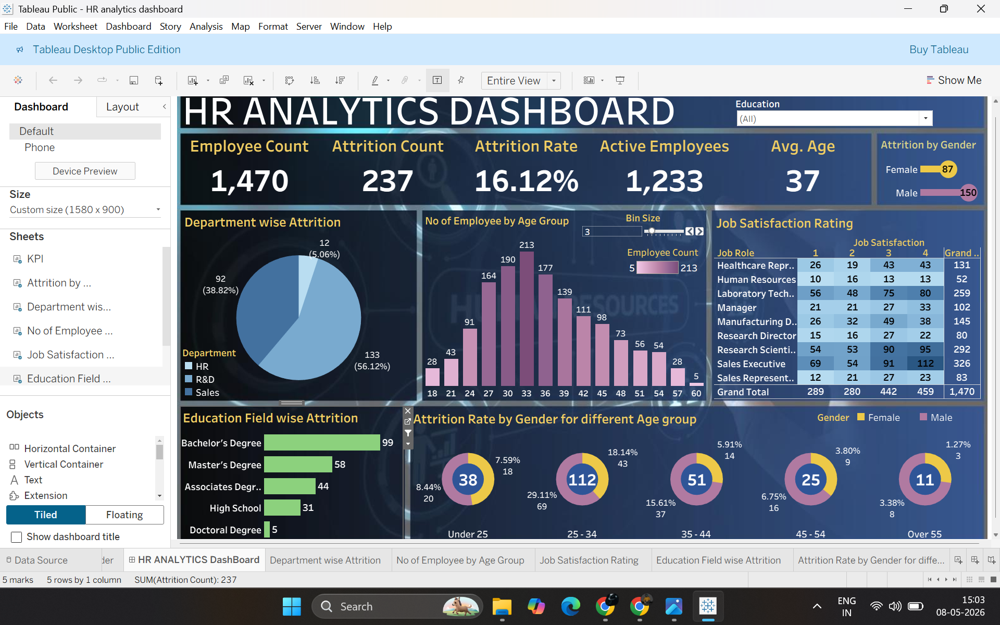

# HR Analytics Dashboard

## 📊 Project Overview
This project provides a comprehensive analysis of human resources data to identify key factors influencing employee attrition. Using Tableau, I developed an interactive dashboard that transforms raw employee records into actionable insights regarding workforce health, demographics, and retention strategies.

## 🎯 Business Objectives
* Analyze the primary drivers of employee attrition across different departments.
* Visualize workforce demographics, including age bands and gender distribution.
* Evaluate the relationship between job satisfaction, environment satisfaction, and turnover.
* Identify high-risk groups based on job roles and education fields.
* Provide a clear breakdown of average monthly income vs. attrition status.

## 🛠️ Tech Stack & Skills
* **Tool:** Tableau Desktop
* **Data Processing:** Cleaned and structured raw HR data for visualization.
* **Calculations:** Created calculated fields to determine attrition rates and age groupings.
* **Analysis:** Performed exploratory data analysis (EDA) to find correlations between overtime and employee departure.
* **Visualization:** Designed an interactive dashboard with **Departmental Filters**, **Interactive Legends**, and **KPI Scorecards**.

## 🖼️ Dashboard Preview

## 📈 Key Insights
* **Attrition Hotspots:** The R&D department shows the highest volume of attrition, while Sales has the highest percentage relative to its size.
* **Age Demographics:** Employees in the 25–34 age band are the most likely to leave the organization, suggesting a need for better early-career engagement.
* **Satisfaction Impact:** There is a direct correlation between low "Environment Satisfaction" scores and higher attrition rates.
* **Work-Life Balance:** Employees who frequently work overtime exhibit a significantly higher turnover rate compared to those who do not.

## 💡 Final Recommendation
To reduce turnover, the organization should implement a targeted retention program for employees in the 25–34 age bracket within the R&D department. Additionally, reviewing workload distribution for roles requiring frequent overtime could significantly improve long-term retention and overall job satisfaction.
